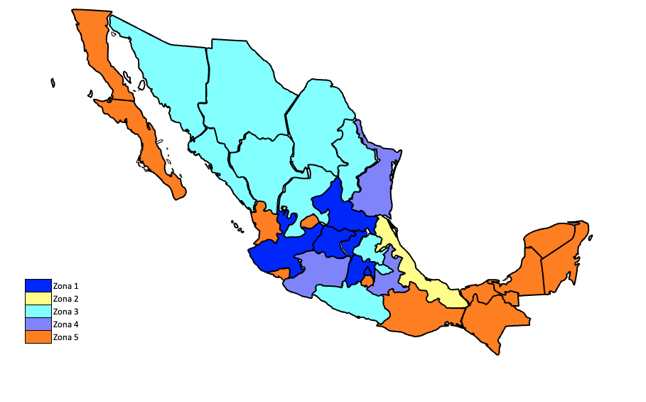

# Microservicios necesarios

## Meet

- [Equipo 1](https://meet.google.com/idm-xsjr-qtc)
  - AGUILERA OLALDE ALEJANDRO
  - GARCIA GONZALEZ LUIS ARTURO
  - PACHECO OSORNIO OSWALDO JESUS
  - HERNANDEZ CORTES BRAYAN
- [Equipo 2](https://meet.google.com/mam-cbue-uxz)
  - FLORES FLORES ISMAEL SALVADOR
  - LEAL AGUILAR ANDRES
  - MELCHOR HERNANDEZ OSCAR ELI
- [Equipo 3](https://meet.google.com/nrg-kyjo-jpe)
  - HERRERA LOPEZ JONATHAN JESUS
  - RUIZ BEDOLLA MANUEL FABIO
  - ZUCHOVICKI PIZZEDAZ EMILIANO NICOLAS
  - SALAZAR CABALLERO ALEJANDRO
  - GUZMAN GUERRERO RAUL

## Consideraciones

- Las zonas se determinan por codigo postal
- A debe de obtener su precio apartir del envio con C y sobre su precio realizar descuentos como marca B; se debe enviar total, metodo de pago, etc a B
- B debe de verififcar los descuentos aplicados para obtener el precio asi como informar los descuentos y cantidad a descontar
- C debe de comprobar los descuentos aplicables al envio, conforme a los metodos de pago, o caracteristicas
- A requiere B y C
- C requiere B

## A. Calcular precio más iva y comisión

### Caracteristicas

- Modelos
  - Price

### Zonificación

| ZONA | IVA % | COMISION % |
| ---- | ----- | ---------- |
| 1    | 16    | 8          |
| 2    | 17    | 15         |
| 3    | 15    | 20         |
| 4    | 12    | 6          |
| 5    | 10    | 5          |

## B. Promociones y cupones

### Caracteristicas

- Modelos
  - Price
  - Coupon

### Consideraciones

> Debe de poder generar cupones con las reglas de % de descuento, monto minimo, zonas a las aplica, expiración y limite de usos

> Las zonas 1 y 2 tienes descuentos del 15% pagando con paypal y del 20% pagando con mastercard usando el cupon MASTER20

> La zona 5 tiene descuento del 10% al pagar con mastercard

> La zona 3 tiene descuento del 15% al comprar más de $4,000 con visa

> La zona 4 tiene envio gratis al comprar más de $3,000 con mastercard

> Todas las zonas tienen envio gratis en compras superiores a $10,000

> Las zonas 1,2 y 3 tienen el 15% en su envio al pagar con visa o mastercard usando el cupon
> PERRITOFELI
> Las zonas 4 y 5 tienen el 10% de descuento en su envio usando el cupón el cupon NOJADO

## C. Precios de envio y tiempo estimados

### Caracteristicas

- Modelos
  - City
  - Postal

### Zonas tarifarias

| Kilos | Zona 1  | Zona 2  | Zona 3  | Zona 4  | Zona 5  |
| ----- | ------- | ------- | ------- | ------- | ------- |
| 1     | $22.89  | $28.61  | $31.19  | $33.99  | $37.05  |
| 2     | $30.90  | $35.77  | $38.98  | $42.49  | $46.32  |
| 3     | $38.63  | $44.71  | $48.73  | $53.12  | $57.90  |
| 4     | $48.28  | $55.88  | $60.91  | $66.40  | $72.37  |
| 5     | $60.35  | $69.85  | $76.14  | $82.99  | $90.46  |
| 6     | $75.44  | $87.32  | $95.18  | $103.74 | $113.08 |
| 7     | $94.30  | $109.15 | $118.97 | $129.68 | $141.35 |
| 8     | $117.88 | $136.44 | $148.71 | $162.10 | $176.69 |
| Extra | $20.36  | $58.89  | $86.99  | $120.93 | $306.89 |

### Tiempos de Envio por zonas

#### Siguiente día habil

- 1,2,4

#### 2-3 Días

- 3

#### 3 días habiles

- 5

# Mapa

